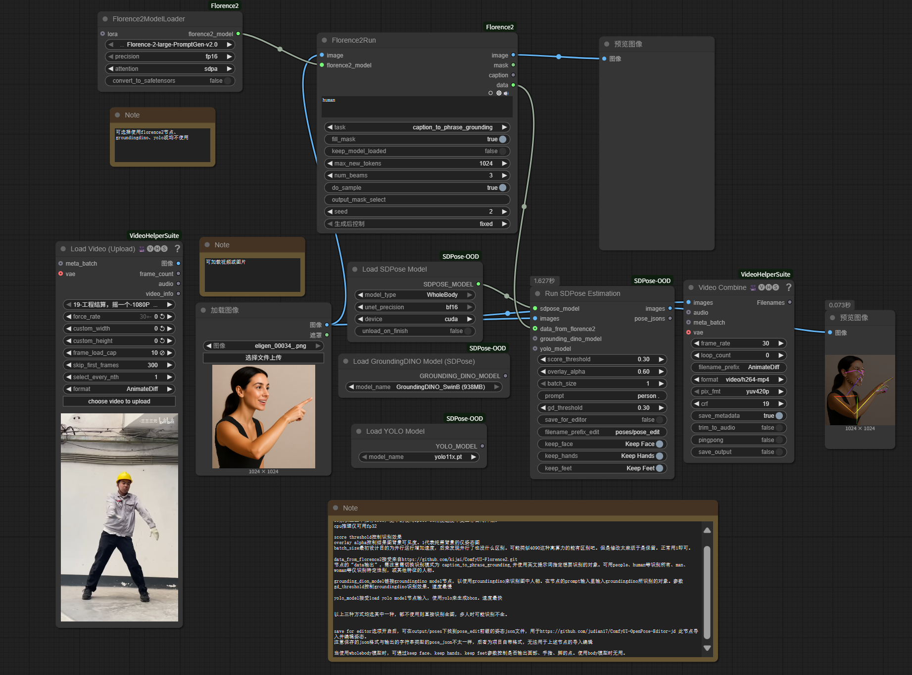

[![English README]](README-EN.md)

# SDPose-OOD for ComfyUI

## 简介

本项目是 [SDPose-OOD](https://github.com/T-S-Liang/SDPose-OOD) 项目的 ComfyUI 自定义节点实现。

它将 SDPose-OOD 强大的姿态估计功能带入 ComfyUI 工作流中，能够从图像中提取高鲁棒性的身体或全身姿态。

## 特性

* **两种模型支持**:
    * **Body**: 17 个关键点，仅身体姿态。
    * **WholeBody**: 133 个关键点，包括身体、面部和手部。
* **自动模型下载**: 节点在首次使用时会自动下载所需的模型。
* **YOLO 集成**: 可选的 YOLO 人物检测，用于精确的多人姿态估计。
* **高级 BBox 检测**: 除了 YOLO，现在还支持使用 **ComfyUI-Florence2** (https://github.com/kijai/ComfyUI-Florence2) 或 **GroundingDINO** (来自 ComfyUI-SAM2: https://github.com/neverbiasu/ComfyUI-SAM2) 进行精确的人物检测。
* **关键点过滤**: 可选保留或移除面部、手部和脚部的关键点，以适应不同需求。
* **精度控制**: 支持 `bf16`, `fp16` 和 `fp32` 推理，以平衡速度和显存占用。
* **OpenPose 编辑器兼容**: 可一键保存姿态为 JSON 文件，用于在 [ComfyUI-OpenPose-Editor](https://github.com/judian17/ComfyUI-OpenPose-Editor-jd) 中导入和编辑。

## 安装

1.  **安装此节点**:
    * 通过 `git clone` 将此仓库克隆到你的 `ComfyUI/custom_nodes/` 目录下。
    * `cd ComfyUI/custom_nodes/SDPose-OOD-ComfyUI`
    * `pip install -r requirements.txt`

2.  **安装模型 (自动或手动)**:
    * **自动 (推荐)**: 节点（`Load SDPose Model`, `Load YOLO Model`）在首次运行时会自动从 Hugging Face 和 Github 下载模型，并将其放置在正确的目录中。
    * **手动**: 你也可以自行下载模型并将它们放入相应的文件夹：
        * **SDPose 模型**: 下载后放入 `ComfyUI/models/SDPose_OOD/`
            * SDPose-Body: [huggingface.co/teemosliang/SDPose-Body](https://huggingface.co/teemosliang/SDPose-Body)
            * SDPose-Wholebody: [huggingface.co/teemosliang/SDPose-Wholebody](https://huggingface.co/teemosliang/SDPose-Wholebody)
        * **YOLO 模型**: 下载后放入 `ComfyUI/models/yolo/`
            * YOLOv8: [yolov8n-pose.pt](https://github.com/ultralytics/assets/releases/download/v8.0.0/yolov8n-pose.pt)
            * YOLOv11: [yolo11x.pt](https://github.com/ultralytics/assets/releases/download/v8.3.0/yolo11x.pt) (或其他 YOLO 模型)
            * 默认的 YOLO 模型（如 `yolov8n-pose.pt`）更适合检测**真人**。
            * SDPose-OOD 本身对动漫人物有很好的处理效果（即使不使用 YOLO）。
            * 如果你不想使用 Florence2/GroundingDINO，可以考虑使用这个对于真人与动漫角色均效果优异的检测模型：[real_person_detection](https://huggingface.co/deepghs/real_person_detection)。下载仓库中的喜欢的版本的model.pt文件置于models/yolo文件夹中。

3.  **安装可选依赖 (用于高级 BBox 检测)**:
    * 如需使用 Florence2，请安装 [ComfyUI-Florence2](https://github.com/kijai/ComfyUI-Florence2)。
    * 如需使用 GroundingDINO，请安装 [ComfyUI-SAM2](https://github.com/neverbiasu/ComfyUI-SAM2) (代码来源于此)。

## 节点说明

### 1. `Load SDPose Model`

* **`model_type`**: 选择 `Body` (17点) 或 `WholeBody` (133点)。
* **`unet_precision`**: 精度选择。
    * `bf16`: 推荐 30 系及以上显卡使用。
    * `fp16`: 推荐 20 系及更早的显卡使用。
    * `fp32`: CPU 推理或需要最高精度时使用。
    * *注意: `bf16`/`fp16` 显著降低显存占用，速度与 `fp32` 几乎相同*。
* **`device`**: `auto` 会自动检测 CUDA。CPU 推理仅支持 `fp32`。

### 2. `Load YOLO Model` (可选)

* 加载一个 YOLO 模型（如 `yolov8n-pose.pt`）。
* 将此节点的 `YOLO_MODEL` 输出连接到 `Run SDPose Estimation` 节点。

### 3. `Run SDPose Estimation`

* **`sdpose_model`**: 来自 `Load SDPose Model` 的模型。
* **`image`**: 你的输入图像。
* **`yolo_model` (可选)**:
    * **未连接 (且 `bbox_input` 也未连接)**: 节点将处理整张图像。这适合单人图像。
    * **已连接**: 节点将首先使用 YOLO 检测图像中的每个人，然后分别处理每个检测到的人物。
* **`bbox_input` (可选)**: 新增输入。可连接来自 **ComfyUI-Florence2** 或 **GroundingDINO** (ComfyUI-SAM2) 的 BBox 输出。
    * *注意*: **检测优先级**: 如果同时连接了 `yolo_model` 和 `grounding_dino_model`或`data_from_florence2`，节点将优先使用 `data_from_florence2`，其次使用groundingdino。
* **`score_threshold`**: 关键点置信度阈值。低于此分数的点将被忽略。
* **`keep_face` (布尔值)**: `True` 则保留面部关键点 (仅 `WholeBody` 有效)。
* **`keep_hands` (布尔值)**: `True` 则保留手部关键点 (仅 `WholeBody` 有效)。
* **`keep_feet` (布尔值)**: `True` 则保留脚部关键点。
* **`overlay_alpha`**: 控制输出图像的可见度。
    * `0.0`: 100% 原始图像。
    * `0.6`: 原始图像与姿态图的混合（原图亮度60%）。
    * `1.0`: 100% 姿态图（纯黑背景）。
* **`save_for_editor` (布尔值)**:
    * **`True`**: 开启后，将保存一个 JSON 文件到 `ComfyUI/output/poses/` 目录，文件名前缀为 `pose_edit`。
    * 这个 JSON 文件可以被 [ComfyUI-OpenPose-Editor](https://github.com/judian17/ComfyUI-OpenPose-Editor-jd) 节点加载以进行后续编辑。
* **`image` (输出)**: 最终的可视化图像（根据 `overlay_alpha` 设置）。
* **`pose_json` (输出)**:
    * **重要**: 这是一个**字符串**输出，包含 SDPose-OOD 项目的*原始* JSON 格式。
    * 此格式与 `save_for_editor` 保存的 JSON 格式**不同**，它不能用于 OpenPose 编辑器节点。

## 工作流示例

1.  `Load Image` 加载你的源图片。
2.  `Load SDPose Model` 选择 `WholeBody` 和 `bf16`。
3.  `Load YOLO Model` 选择 `yolov8n-pose.pt`。 (或使用 Florence2 / GroundingDINO 连接到 `bbox_input`)
4.  将以上三者（或替换3为BBox节点）连接到 `Run SDPose Estimation`。
5.  设置 `overlay_alpha` 为 `1.0` (如果你想要一个纯姿态图)。
6.  设置 `save_for_editor` 为 `True` (如果你想稍后编辑它)。
7.  连接 `Preview Image` 查看 `image` 输出。